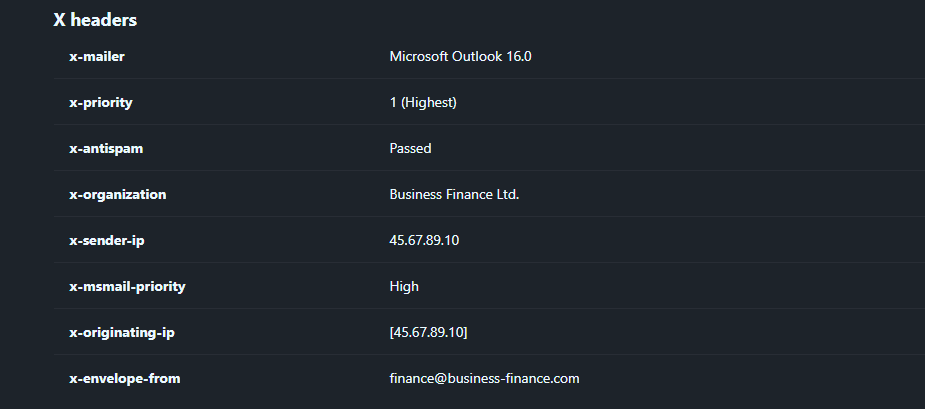

# PhishNet

Created by: Anh Tuan
Last edited: November 18, 2025 11:05 AM

> **An accounting team receives an urgent payment request from a known vendor. The email appears legitimate but contains a suspicious link and a .zip attachment hiding malware. Your task is to analyze the email headers, and uncover the attacker's scheme.**
> 

Truy cập https://eml-analyzer.herokuapp.com/ và tải file `.eml` lên để phân tích.

- **What is the originating IP address of the sender?**
    
    Sau khi trang web phân tích xong, kéo xuống xem kết quả ở phần `X headers`
    
    
    
- **Which mail server relayed this email before reaching the victim?**
    
    Kéo lên `Header` tìm đến `Hops`, tìm thấy IP của relay server
    
    
    
- **What is the sender's email address?**
    
    Ngay bên dưới phần `Basic Headers` tìm thấy người gửi mail
    
    
    
- **What is the 'Reply-To' email address specified in the email?**
    
    Ấn `Ctrl+F` để bật hộp thoại tìm kiếm. Tìm kiếm `reply-to` 
    
    
    
- **What is the SPF (Sender Policy Framework) result for this email?**
    
    SPF=pass
    
    
    
- **What is the domain used in the phishing URL inside the email?**
    
    Kéo xuống đọc bodies
    
    
    
- **What is the fake company name used in the email?**
    
    Cũng ở trong phần bodies, đọc nội dung mail sẽ tìm thấy tên của `fake company`
    
    → Business Finance Ltd.
    
- **What is the name of the attachment included in the email?**
    
    
    
- **What is the SHA-256 hash of the attachment?**
    
    → 8379c41239e9af845b2ab6c27a7509ae8804d7d73e455c800a551b22ba25bb4a
    
- **What is the filename of the malicious file contained within the ZIP attachment?**
    
    
    
- **Which MITRE ATT&CK techniques are associated with this attack?**
    
    Vào https://attack.mitre.org/, tìm kiếm Phishing và chọn **Attachment**
    
    