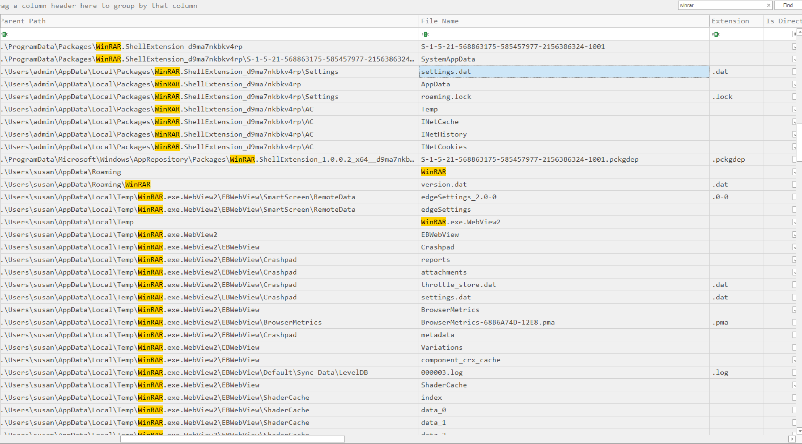

# RomCom

Created by: Anh Tuan
Last edited: November 11, 2025 12:02 AM

> **Susan works at the Research Lab in Forela International Hospital. A Microsoft Defender alert was received from her computer, and she also mentioned that while extracting a document from the received file, she received tons of errors, but the document opened just fine. According to the latest threat intel feeds, WinRAR is being exploited in the wild to gain initial access into networks, and WinRAR is one of the Software programs the staff uses. You are a threat intelligence analyst with some background in DFIR. You have been provided a lightweight triage image to kick off the investigation while the SOC team sweeps the environment to find other attack indicators.**
> 
- **What is the CVE assigned to the WinRAR vulnerability exploited by the RomCom threat group in 2025?**
    
    Sử dụng `MFTECmd` trong https://ericzimmerman.github.io/#!index.md để parse file `$MFT` thành .csv
    
    ```bash
    .\MFTECmd.exe -f 'E:\C\$MFT' --csv ..\HTB\Sherlocks\RomCom\
    ```
    
    Mở file `.csv` bằng `Timeline Explorer` và tìm kiếm winrar trong file này
    
    
    
    Có vẻ như winrar lợi dụng `Webview2` để thực thi lệnh. Tìm kiếm **cve winrar webview2**
    
    
    
- **What is the nature of this vulnerability?**
    
    Truy cập https://nvd.nist.gov/vuln/detail/CVE-2025-8088 để đọc về lỗ hổng
    
    
    
- **What is the name of the archive file under Susan's documents folder that exploits the vulnerability upon opening the archive file?**
    
    Với winrar, đuôi nén của file sẽ là `.rar` file này được nằm trong thư mục `Documents` của user `Susan`
    
    
    
- **When was the archive file created on the disk?**
    
    Vẫn ở dòng đấy kéo sang bên phải sẽ tìm được `Last Modified0x10`
    
    → 2025-09-02 08:13:50
    
- **When was the archive file opened?**
    
    Vẫn ở dòng đấy kéo sang bên phải sẽ tìm được `Last Record Change0x10`
    
    → 2025-09-02 08:14:04
    
- **What is the name of the decoy document extracted from the archive file, meant to appear legitimate and distract the user?**
    
    Quay trở `File Name` sẽ thấy ngoài file còn 1 file `.pdf` file này hợp pháp và sạch hoàn toàn, nhằm mục đích đánh lừa người dùng
    
    
    
    → Genotyping_Results_B57_Positive.pdf
    
- **What is the name and path of the actual backdoor executable dropped by the archive file?**
    
    Mở file `$J` csv, tìm đến chỗ các file rar được tạo
    
    
    
    File có tên `ApbxHelper.exe` được tạo sau khi file rar được thực thi. Copy nó và tìm nó ở bên `$MFT`
    
    
    
    → C:\Users\Susan\Appdata\Local\ApbxHelper.exe
    
- **The exploit also drops a file to facilitate the persistence and execution of the backdoor. What is the path and name of this file?**
    
    filter thêm đuôi `.lnk` sẽ tìm được file ở bên trong `$J`
    
    
    
    Quay sang tìm path ở bên `$MFT`
    
    
    
    → C:\Users\Susan\AppData\Roaming\Microsoft\Windows\Start Menu\Programs\Startup\Display Settings.lnk
    
- **What is the associated MITRE Technique ID discussed in the previous question?**