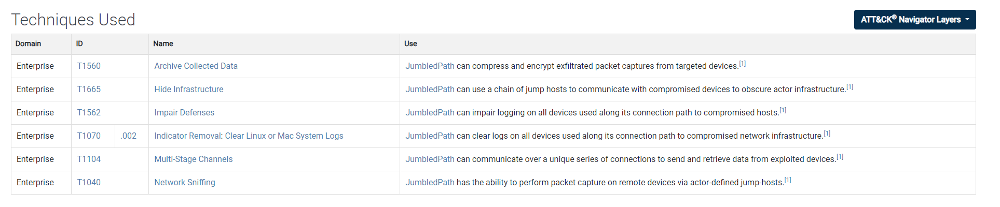

# SalineBreeze-1

Created by: Anh Tuan
Last edited: November 19, 2025 11:25 AM

> **Your manager has just informed you that, due to recent budget cuts, you'll need to take on additional responsibilities in threat analysis. As a junior threat intelligence analyst at a cybersecurity firm, you're now tasked with investigating a cyber espionage campaign linked to a group known as Salt Typhoon. Apparently, defending against sophisticated Nation-State cyber threats is now a "do more with less" kind of game. Your Task: Conduct comprehensive research on Salt Typhoon, focusing on their tactics, techniques, and procedures. Utilize the MITRE ATT&CK framework to map out their activities and provide actionable insights. Your findings could play a pivotal role in fortifying our defenses against this adversary. Dive deep into the data and show that even with a shoestring budget, you can outsmart the cyber baddies.**
> 
- **Starting with the MITRE ATT&CK page, which country is thought be behind Salt Typhoon?**
    
    https://attack.mitre.org/và tìm  **Salt Typhoon**
    
    → china
    
- **According to that page, Salt Typhoon has been active since at least when? (Year)**
    
    → 2019
    
- **What kind of infrastructure does Salt Typhoon target?**
    
    → Network
    
- **Salt Typhoon has been associated with multiple custom built malware, what is the name of the malware associated with the ID S1206?**
    
    Ctrl+F để tìm S2106 → [JumbledPath](https://attack.mitre.org/software/S1206)
    
- **What operating system does this malware target?**
    
    Vào https://attack.mitre.org/software/S1206 để tìm kiếm thông tin → Linux
    
- **What programming language is the malware written in?**
    
    → go
    
- **On which vendor's devices does the malware act as a network sniffer?**
    
    → Cisco
    
- **The malware can perform 'Indicator Removal' by erasing logs. What is the MITRE ATT&CK ID for this?**
    
    
    
    → T1070.002
    
- **On December 20th, 2024, Picus Security released a blog on Salt Typhoon detailing some of the CVEs associated with the threat actor. What was the CVE for the vulnerability related to the Sophos Firewall?**
    
    Search trong trình tìm kiếm, set lại thời gian vào `12/20/2024` 
    
    
    
    → CVE-2022-3236
    
- **The blog demonstrates how the group modifies the registry to obtain persistence with a backdoor known as Crowdoor. Which registry key do they target?**
    
    → HKCU\Software\Microsoft\Windows\CurrentVersion\Run
    
- **What is the MITRE ATT&CK ID of the previous technique?**
    
    → **T1112**
    
- **On November 25th, 2024, TrendMicro published a blog post detailing the threat actor. What name does this blog primarily use to refer to the group?**
    
    Set lại thời gian thành `11/25/2024` , tìm kiếm với thông tin TrendMicro và **Crowdoor**
    
    
    
    Đọc và phân tích thông tin trong link → **Earth Estries**
    
- **The blog post identifies additional malware attributed to the threat actor. Which malware do they describe as a 'multi-modular backdoor...using a custom protocol protected by Transport Layer Security'**
    
    → GhostSpider
    
- **Most of the domains the malware communicates with have a .com top-level domain. One uses a .dev TLD. What is the full domain name for the .dev TLD?**
    
    Sau khi đọc đến cuối bài viết, ở phần **Indicators of Compromise,** TrendMicro đã list ra 1 danh sách cả IOCs, bên trong tổng hợp lại các domain có communication.
    
    → telcom.grishamarkovgf8936.workers.dev
    
- **What is the filename for the first GET request to the C&C server used by the malware?**
    
    → index.php
    
- **On September 30th, 2021, a blog post was released on Securelist by Kaspersky. What was the threat actor's name at that time?**
    
    Đọc bài https://securelist.com/ghostemperor-from-proxylogon-to-kernel-mode/104407/
    
    → GhostEmperor
    
- **What is the name of the malware that this article focuses on?**
    
    Tiếp tục đọc bài.
    
    → Demodex
    
- **What type of malware is the above malware?**
    
    → Rootkit
    
- **The first stage consists of a malicious PowerShell dropper. What type of encryption is used to obfuscate the code?**
    
    Đọc PDF của Kaspersky được đính kèm trong bài đọc.
    
    → AES
    
- **The malware uses Input/Output Control codes to perform various tasks related to hiding malicious artifacts. What is the IOCTL code used by the malware to hide its service from the list within the services.exe process address space?**
    
    Quay trở lại https://securelist.com/ghostemperor-from-proxylogon-to-kernel-mode/104407/ và tìm đến **Demodex rootkit functionality**
    
    → **0x220300**